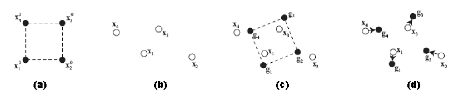

# Elastic Shape Animation based on Shape Matching

## Description

In This project, we model elastic animation through deformation based on Shape Matching. This method leads to **less computationally expensive**, **realistic** animations.
The following image shows an schematic of the principle of the deformation based on Shape Matching.

